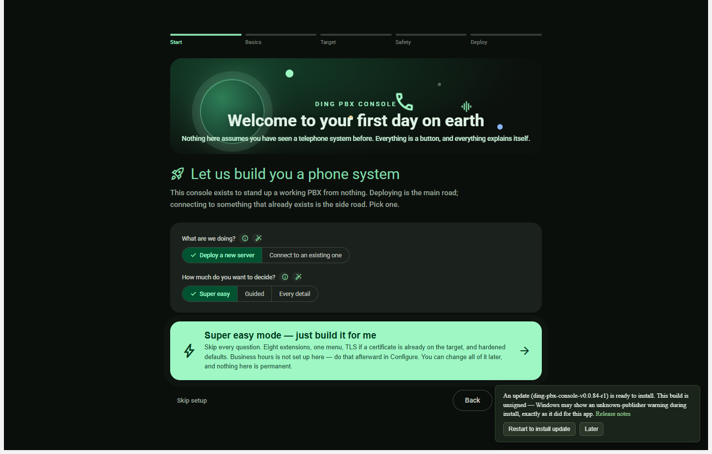

# Automatic update evidence

This article records the two real off-screen captures committed with the updater repair. The images were supplied by the bounded Lowlevel capture run and copied byte-for-byte. They were not generated, resized, annotated, or edited during this evidence pass.

## Release and source records

The old baseline was the `ding-pbx-console-v0.0.82-r1` release at source commit `745d7425df791646aef4a6972c96dcf279a6004a`, carrying the old installed package version `0.1.0` and a manifest that recorded only its tag. Its restart button used the old send-only path, so a click could not receive a typed acknowledgement or keep a spawn failure visible.

The repaired release used for the update-ready capture was source commit `870be47d6708b32f7fed154abf0ca3779f1fe3bb`, package version `0.1.84`, and tag `ding-pbx-console-v0.0.84-r1`. Its release identity recorded the exact `Setup.exe`, `RELEASES`, full package, and SHA-256 values. The installed `0.1.84` capture used that same source and release identity. The follow-up source record merged for the next release is `b29850dd1ae63553dc6c60ecdedc60adb6707a77`, carrying package version `0.1.85` and tag `ding-pbx-console-v0.0.85-r1`.

## Capture records

| State | Source and release | Dimensions | SHA-256 | Evidence |
| --- | --- | ---: | --- | --- |
| Update ready from the old installed baseline | `745d7425df791646aef4a6972c96dcf279a6004a`, installed `0.1.0`, candidate `870be47d6708b32f7fed154abf0ca3779f1fe3bb`, release `0.1.84`, tag `ding-pbx-console-v0.0.84-r1` | 1456 x 928 | `3a92900f8fd19a722ece3175567df346d8f272ee24d7ac47e3681b1db5216d99` |  |
| Installed `0.1.84` with two PBX drafts blocking restart | `870be47d6708b32f7fed154abf0ca3779f1fe3bb`, installed `0.1.84`, candidate `b29850dd1ae63553dc6c60ecdedc60adb6707a77`, release `0.1.85`, tag `ding-pbx-console-v0.0.85-r1` | 1456 x 928 | `79d4257a806ef31aea22cef34ce490cc980fdd527ce84a5adfe60e6bd197b751` |  |

## Capture method and interaction evidence

The Windows desktop executable was launched on named hidden desktops through the Lowlevel route, with no visible desktop or pointer interaction. The old baseline used `Lowlevel-Updater-Run84`, port `9346`, and the exact file URL for the extracted baseline renderer. The installed repaired application used `Lowlevel-Installed84-Run85`, port `9347`, and the exact file URL for `C:\ding-pbx-console\app-0.1.84\resources\app.asar\dist\index.html`.

Each capture plan required a task-local CDP endpoint, an exact expected URL, bounded synchronous evaluation, and a single page target before evaluating the renderer. No target was selected by index or by a partial URL match. The setup diagnostic was launched directly from the staged `Ding-PBX-Console-Setup.exe`; the recorded process was `33380`, which proves the direct installer launch path reached the operating system even though the installer does not expose an application page target.

The old baseline restart plan clicked the first restart control on the old build, exposing the missing acknowledgement and failure-reporting contract. The repaired ready plans reached `Restart to install update`, the direct `Setup.exe` process launch was observed, and the repaired path kept the application open when a forced spawn failure was requested. The `Later` plan hid the banner while preserving the staged candidate, and the draft plan sent a count of `2`, observed the exact review, apply, or discard message, and confirmed that restart was disabled.

## Verification boundary

These records prove the named built-artifact states and the exact capture method. They do not claim a complete release, installer, or production deployment verdict. The source and release SHAs, package versions, dimensions, and digests above are the evidence identifiers for this pair.

## Suggested articles

[Automatic updates](../platform/automatic-updates.md), [In-context recovery](../platform/in-context-recovery.md), [Non-blocking notifications](../platform/non-blocking-notifications.md), [Platform feature index](../platform/README.md).
